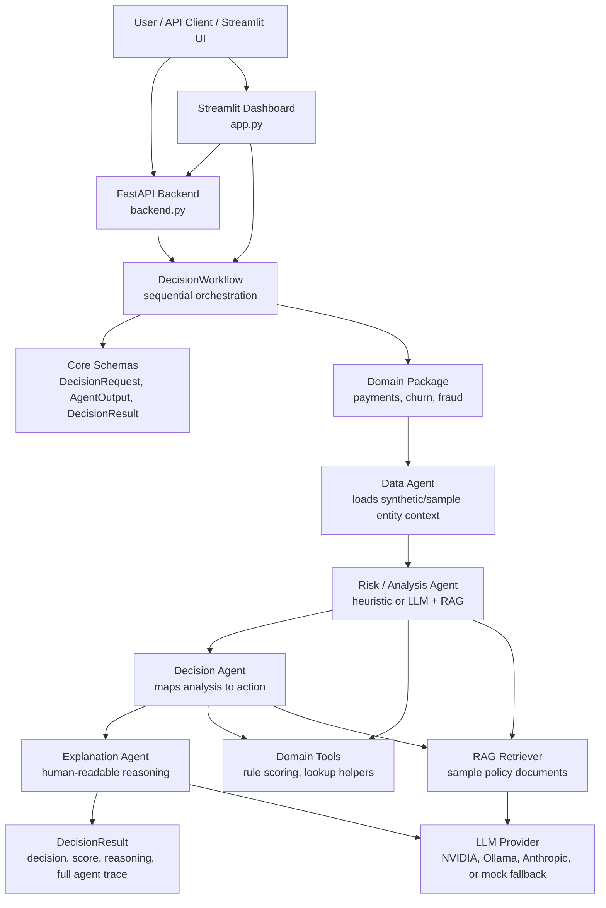

# Multi-Agent GenAI Decision Framework

A domain-agnostic agentic AI framework for explainable decision orchestration across Payments, Churn, and Fraud, with heuristic agents, optional LLM + RAG reasoning, a FastAPI backend, a Streamlit dashboard, and auditable agent traces.

This project is not positioned as a predictive ML model. It demonstrates how domain agents can gather synthetic context, apply heuristic or LLM-assisted reasoning, retrieve policy guidance with RAG, produce a decision, and return an auditable trace of how that decision was made.

Supported domains:

- Payments: payment review orchestration
- Churn: retention action orchestration
- Fraud: transaction risk action orchestration

The repository includes a reusable core agent framework, domain-specific agents and tools, LLM + RAG variants, a FastAPI backend, a Streamlit dashboard, and tests.

## What This Project Shows

- Sequential multi-agent workflows with shared evolving context
- Domain-specific data, risk, decision, and explanation agents
- Heuristic agents for deterministic local behavior
- LLM agents with RAG policy retrieval for richer reasoning paths
- Graceful LLM fallback/mock behavior when API keys or providers are unavailable
- Full agent trace output for explainability and debugging
- REST API and dashboard interfaces over the same workflow concept

## Business Use Cases

This repo is built around business workflows where a decision needs both a recommendation and a traceable rationale:

- Payments: route transactions to `APPROVE`, `DECLINE`, or `REVIEW` using customer context, amount, synthetic history, and policy-style reasoning.
- Churn: choose a retention action such as proactive outreach or urgent intervention using sample customer engagement context.
- Fraud: select actions such as monitor, challenge, block, or approve using synthetic transaction features and sample fraud policies.
- Operations review: expose every intermediate agent output so a reviewer can inspect what data was used, what reasoning was applied, and why a final action was chosen.
- GenAI architecture demo: show where deterministic rules, RAG context, and optional LLM reasoning fit into the same orchestration layer.

These use cases are demonstrations of decision-system design. They are not claims of validated financial, fraud, or churn performance.

## What This Project Does Not Claim

- It does not claim production readiness.
- It does not use real customer, transaction, fraud, or churn datasets.
- It does not claim real fraud detection accuracy or churn prediction accuracy.
- It is not a trained predictive model or model evaluation benchmark.
- It is a portfolio/interview project focused on decision orchestration, system design, and explainability.

## Architecture



## Demo Screenshots

Screenshot placeholders for a recruiter-facing walkthrough:

- [Dashboard home](assets/dashboard_home.png)
- [Payments result](assets/payments_result.png)
- [Agent trace](assets/agent_trace.png)
- [FastAPI docs](assets/fastapi_docs.png)

## Repository Layout

```text
.
|-- app.py                         # Streamlit dashboard
|-- backend.py                     # FastAPI backend
|-- requirements.txt
|-- src/
|   |-- core/
|   |   |-- agent.py               # Base Agent abstraction
|   |   |-- schemas.py             # Request/output/result models
|   |   |-- tools.py               # Generic tool registry
|   |   `-- workflow.py            # Sequential workflow executor
|   `-- domains/
|       |-- payments/              # Payment agents, tools, sample data, RAG docs
|       |-- churn/                 # Churn agents, tools, sample data, RAG docs
|       `-- fraud/                 # Fraud agents, tools, sample data, RAG docs
`-- tests/                         # Core, domain, workflow, LLM mock-mode tests
```

## Agent Flow

Each domain follows the same orchestration pattern:

1. Data agent gathers synthetic/sample entity context.
2. Risk or analysis agent evaluates the context using heuristics or LLM + RAG.
3. Decision agent maps the analysis to a business action.
4. Explanation agent turns the decision path into user-facing reasoning.
5. The workflow returns the final decision plus every intermediate agent output.

Example action spaces:

- Payments: `APPROVE`, `DECLINE`, `REVIEW`
- Churn: `EXECUTIVE_OUTREACH`, `URGENT_RETENTION`, `PROACTIVE_OUTREACH`, `STANDARD_ENGAGEMENT`
- Fraud: `BLOCK`, `CHALLENGE`, `MONITOR`, `APPROVE`

These actions are generated from sample rules and synthetic data. They should be treated as demonstration outputs, not operational recommendations.

## Heuristic Mode vs LLM + RAG Mode

### Heuristic Mode

Heuristic mode is deterministic and runs locally without API keys. It uses synthetic/sample data, domain tools, and rule-style scoring to produce a decision and explanation trace.

Use heuristic mode when you want:

- Fast local demos
- Repeatable test behavior
- A clear baseline for comparing agent orchestration paths
- No dependency on external LLM providers

### LLM + RAG Mode

LLM + RAG mode keeps the same workflow structure but replaces selected analysis, decision, and explanation agents with LLM-backed agents. Those agents retrieve relevant sample policy documents before prompting the model.

LLM agents try providers in this order:

1. NVIDIA API
2. Ollama local or cloud
3. Anthropic Claude
4. Deterministic mock fallback

If no API key is configured, or a provider call fails, the LLM agents return deterministic fallback text so the project remains runnable and testable locally. The RAG layer uses sample policy documents included in the repository and may fall back to deterministic keyword retrieval.

Create a `.env` file from `.env.example` when you want live LLM behavior:

```bash
cp .env.example .env
```

On Windows PowerShell:

```powershell
Copy-Item .env.example .env
```

Live LLM usage is optional. Tests and local demos can run without provider keys.

## Setup

```bash
python -m venv .venv
source .venv/bin/activate
python -m pip install -r requirements.txt
```

On Windows PowerShell:

```powershell
python -m venv .venv
.\.venv\Scripts\Activate.ps1
python -m pip install -r requirements.txt
```

## Run The FastAPI Backend

```bash
python backend.py
```

Alternative:

```bash
uvicorn backend:app --reload --host 0.0.0.0 --port 8000
```

Health check:

```bash
curl http://localhost:8000/health
```

Expected shape:

```json
{
  "status": "healthy",
  "domains": ["payments", "churn", "fraud"],
  "agent_types": ["heuristic", "llm"]
}
```

## Run The Streamlit Dashboard

```bash
streamlit run app.py
```

The dashboard supports:

- Payments, Churn, and Fraud workflows
- Heuristic or LLM agent selection
- Optional FastAPI backend mode
- Standalone heuristic mode when the backend is unreachable
- Full agent trace inspection

Valid demo IDs are generated from synthetic/sample data:

- Customers: `CUST_00000` through `CUST_00049`
- Transactions: `TXN_00000000` through `TXN_00000099`

## API Examples

### Payments

```bash
curl -X POST http://localhost:8000/analyze/payments \
  -H "Content-Type: application/json" \
  -d '{"customer_id":"CUST_00000","amount":2500.0,"agent_type":"heuristic"}'
```

LLM/RAG mode:

```bash
curl -X POST http://localhost:8000/analyze/payments \
  -H "Content-Type: application/json" \
  -d '{"customer_id":"CUST_00000","amount":2500.0,"agent_type":"llm"}'
```

### Churn

```bash
curl -X POST http://localhost:8000/analyze/churn \
  -H "Content-Type: application/json" \
  -d '{"customer_id":"CUST_00012","agent_type":"heuristic"}'
```

### Fraud

```bash
curl -X POST http://localhost:8000/analyze/fraud \
  -H "Content-Type: application/json" \
  -d '{"transaction_id":"TXN_00000005","agent_type":"llm"}'
```

### Response Shape

```json
{
  "domain": "payments",
  "decision": "REVIEW",
  "decision_score": 0.72,
  "reasoning": "Human-readable explanation from the final agent.",
  "agent_outputs": [
    {
      "agent": "payment_data_agent",
      "analysis": {}
    },
    {
      "agent": "payment_risk_agent",
      "analysis": {}
    }
  ],
  "agent_type": "heuristic"
}
```

The exact decision and score depend on the synthetic entity selected, the amount provided, and whether heuristic or LLM mode is used.

## Use The Core Framework In Python

```python
import asyncio

from src.core.schemas import DecisionRequest
from src.core.workflow import DecisionWorkflow
from src.domains.payments.agents import (
    PaymentDataAgent,
    PaymentRiskAgent,
    PaymentDecisionAgent,
    PaymentExplanationAgent,
)
from src.domains.payments.data import PaymentDataGenerator
from src.domains.payments.tools import create_tools


async def main():
    generator = PaymentDataGenerator(seed=42)
    customers = generator.generate_customers(50)
    transactions = generator.generate_transactions(customers, 100)
    tools = create_tools(customers, transactions)

    workflow = DecisionWorkflow(
        [
            PaymentDataAgent(tools),
            PaymentRiskAgent(tools),
            PaymentDecisionAgent(tools),
            PaymentExplanationAgent(tools),
        ],
        "payment_demo",
    )

    result = await workflow.execute(
        DecisionRequest(
            domain="payments",
            entity_id="CUST_00000",
            context={"customer_id": "CUST_00000", "amount": 2500.0},
        )
    )

    print(result.decision)
    print(result.reasoning)


asyncio.run(main())
```

## Evaluation Philosophy

This project evaluates orchestration behavior, not real-world predictive accuracy.

The test suite is designed to check that:

- Agents return structured outputs.
- Workflows pass context from one agent to the next.
- Domain tools and sample data generators behave consistently.
- RAG retrievers return usable sample policy context.
- LLM agents remain testable through deterministic fallback/mock behavior.
- End-to-end workflows produce a final decision plus an auditable trace.

A production-grade fraud, churn, or payments system would need separate evaluation against real labeled data, calibrated metrics, model monitoring, bias and drift checks, security review, human review controls, and business approval processes.

## Testing

Run the full test suite:

```bash
python -m pytest tests/ -v
```

The tests cover:

- Core agent and workflow behavior
- Domain-specific heuristic agents
- Domain tools and sample data generators
- End-to-end sequential workflows
- RAG retriever behavior
- LLM agents in deterministic mock/fallback mode

Because mock mode is supported, the test suite does not require live LLM API keys.

## Limitations

- Data is synthetic/sample only.
- RAG policy documents are small, local examples.
- Heuristic rules are intentionally simple and demonstrative.
- LLM outputs are provider-dependent when live keys are configured.
- Fallback/mock LLM behavior is deterministic and useful for demos/tests, but it is not a replacement for real model validation.
- There is no production authentication, authorization, persistence, monitoring, queueing, or deployment hardening.
- Decision scores are orchestration confidence/risk signals from rules or agent outputs, not calibrated predictive probabilities.

## Recruiter And Interview Notes

This project is useful to discuss as a system design and applied GenAI project:

- It separates orchestration infrastructure from domain-specific agents.
- It demonstrates explainability through complete agent traces.
- It supports both deterministic heuristics and LLM-assisted reasoning.
- It shows how RAG can inject policy context into decision workflows.
- It exposes the same workflow through API and dashboard interfaces.
- It remains runnable without paid API keys through mock fallback behavior.

Good interview talking points:

- Why sequential agent orchestration is useful for explainable business decisions
- How the `DecisionWorkflow` passes context between agents
- Where heuristics are preferable to LLM calls
- How LLM fallback behavior improves local developer experience
- What would be required before production use: real data validation, model evaluation, audit controls, monitoring, security, persistence, and human review workflows
