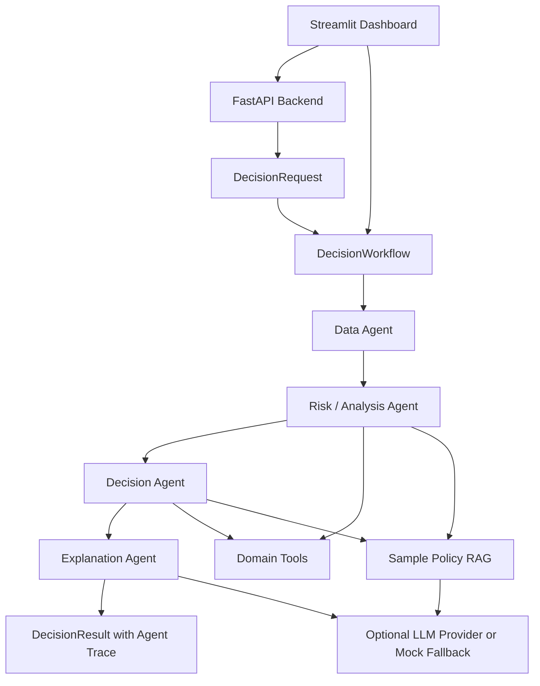

# Architecture

## Overview

This project is a Multi-Agent GenAI Decision Framework for explainable business decision orchestration across Payments, Churn, and Fraud.

It is not a trained predictive ML model. The system demonstrates how a reusable workflow can coordinate domain-specific agents, heuristic rules, optional LLM + RAG reasoning, API access, dashboard interaction, and auditable agent traces using synthetic/sample data.

## Core Workflow

The reusable orchestration layer is centered on `DecisionWorkflow`. A workflow receives a decision request, runs agents in a defined sequence, passes each agent's output into the evolving context, and returns a final decision result.

Conceptually:

```text
DecisionRequest
  -> Data Agent
  -> Risk / Analysis Agent
  -> Decision Agent
  -> Explanation Agent
  -> DecisionResult
```

Each domain plugs in its own agents, tools, sample data, RAG documents, and decision labels while keeping the workflow pattern consistent.

## Core Schemas

### DecisionRequest

`DecisionRequest` is the domain-agnostic input envelope.

It includes:

- `domain`: the business area, such as `payments`, `churn`, or `fraud`
- `entity_id`: the customer or transaction identifier
- `context`: domain-specific input values
- `request_id`: generated request identifier for traceability

Example:

```json
{
  "domain": "payments",
  "entity_id": "CUST_00000",
  "context": {
    "customer_id": "CUST_00000",
    "amount": 2500.0
  }
}
```

### AgentOutput

`AgentOutput` captures the output of a single agent.

It includes:

- `agent_name`: the agent that produced the output
- `analysis`: structured agent-specific findings
- `tools_used`: tools or retrievers used by the agent
- `reasoning`: human-readable rationale

This is the unit that makes the workflow auditable. A reviewer can inspect each step rather than only seeing the final decision.

### DecisionResult

`DecisionResult` is the final workflow output.

It includes:

- `decision`: final action selected by the workflow
- `decision_score`: rule or agent-generated score, not a calibrated predictive probability
- `reasoning`: final explanation
- `agent_outputs`: complete ordered trace of agent outputs
- `domain`: the domain that was analyzed

## Agent Sequence

The standard sequence is:

1. Data Agent: loads synthetic/sample entity context.
2. Risk or Analysis Agent: evaluates the context using heuristic rules or LLM + RAG.
3. Decision Agent: maps the analysis to a domain action.
4. Explanation Agent: creates a user-readable rationale.

Example action spaces:

- Payments: `APPROVE`, `DECLINE`, `REVIEW`
- Churn: `EXECUTIVE_OUTREACH`, `URGENT_RETENTION`, `PROACTIVE_OUTREACH`, `STANDARD_ENGAGEMENT`
- Fraud: `BLOCK`, `CHALLENGE`, `MONITOR`, `APPROVE`

These are demonstration actions generated from synthetic/sample inputs and local rules or optional LLM reasoning. They are not validated production recommendations.

## Heuristic Mode

Heuristic mode runs locally without external model providers.

It uses:

- synthetic/sample data generators
- deterministic domain tools
- rule-style scoring and decision mapping
- structured agent outputs

This mode is useful for tests, demos, and explaining the orchestration pattern without relying on API keys.

## LLM + RAG Mode

LLM + RAG mode keeps the same workflow structure but swaps selected agents for LLM-backed agents.

The RAG layer retrieves relevant sample policy documents. The LLM agent then uses the current context and retrieved policy context to produce analysis, decision reasoning, or explanation text.

If provider keys are missing or provider calls fail, LLM agents fall back to deterministic mock behavior. This keeps the project runnable and testable, but the fallback should not be interpreted as real model performance.

## FastAPI Role

The FastAPI backend exposes the framework through REST endpoints:

- `/health`
- `/analyze/payments`
- `/analyze/churn`
- `/analyze/fraud`

The API lets a caller choose the domain and agent type, then returns the final decision plus agent trace. This makes the framework easier to integrate with external clients or demonstrate through API docs.

## Streamlit Role

The Streamlit dashboard provides an interactive demo layer.

It supports:

- choosing Payments, Churn, or Fraud
- selecting heuristic or LLM mode
- calling the FastAPI backend
- running local heuristic workflows when the backend is unavailable
- inspecting the final decision and full agent trace

The dashboard is designed for demonstration and interview walkthroughs, not production operations.

## Architecture Diagram



## Future Architecture Improvements

- Add persistence for requests, decisions, and traces.
- Add authentication and authorization for API access.
- Add human review queues for high-risk decisions.
- Add structured evaluation datasets for each domain.
- Add monitoring for latency, fallback rates, and decision distribution drift.
- Add versioning for rules, prompts, RAG documents, and agent configurations.

